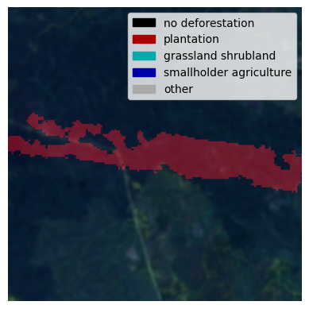
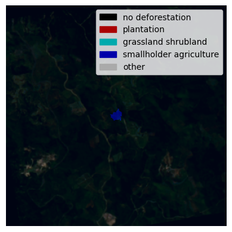

# Indonesia Deforestation Segmentation
`Top 1 solution` for Indonesia Deforestation Segmentation Challenge. `(0.379 Dice Score on LB)` <br>
 
## Additional Data link
In this work, I use a public dataset and add it into the provided dataset. You can download the data here: [ForestNet dataset](https://stanfordmlgroup.github.io/projects/forestnet/) <br>
The additional data contain the mask as `forest_loss_region.pkl` files, so I processed to `png` files in `eda2.py`. After running this python code, you will get the `png mask-image files` as well as the `csv file` containing the annontation of them.


# Pretrained Weights
You can find the pretrained model here: [link](https://drive.google.com/drive/folders/12HQBT4S2-dOSrLTwbLfwjVbIF15c8mBo?usp=sharing)

## Model Used in the Challenge
I used UNetPlusPlus with NFNet backbone, and I used visible and infrared images as the inputs.

## How to Run
For training:
```
python training.py
```
For validation:
```
python inference.py
```

## Technique
[x] UNetPlusPlus (and other models you can find in my code) <br>
[x] TTA (geometric and pixel level TTAs) <br>
[x] Ensemble (In the scope of this competition, I did not use ensemble but I have included the ensemble code in my code) <br>
[x] Models using auxilary information (latitude, longtitude, year) <br>
[x] Use SegFormer to finetune <br>
[x] Cutmix <br>
[x] Mixup without hesitation <br>
[x] KFold training <br>


## Further Improvement
[] Heavy TTA. (zoom-in, rotation more) <br>
[x] Postprocess (Morphology, Connected Components) <br>
[] Use SAM to finetune the model <br>


## Reference
[Challenge website](https://datameka.com/competition/632c46a4-9c05-4911-a8c2-08226d2fb4e4?tabIndex=7) <br>
[ForestNet](https://stanfordmlgroup.github.io/projects/forestnet/)

## Author
`Thanh-Tin Nguyen`